# Blockchain Data

Blockchain has the potential to change the way that the world approaches data. Develop Blockchain skills by understanding the data model behind Blockchain by developing your own simplified private blockchain.

###### LICENCE FOR COPYING: License for Private Blockchain project

## Getting Started

These instructions will get you a copy of the project up and running on your local machine for development and testing purposes.

### Prerequisites

Installing Node and NPM is pretty straightforward using the installer package available from the (Node.js® web site)[https://nodejs.org/en/].

### Configuring your Project

- Use NPM to initialize your project and create package.json to store project dependencies.
```
npm init
```
- Install crypto-js with --save flag to save dependency to our package.json file
```
npm install crypto-js --save
```
- Install level with --save flag
```
npm install level --save
```

- Add levelSanbox.js and simpleChain.js to Project

## Testing

To test code:
1: Open a command prompt or shell terminal after install node.js.

2: Enter a node session, also known as REPL (Read-Evaluate-Print-Loop).
```
node
```
3: Copy and paste your code [levelSanbox.js and simpleChain.js] into your node session

4: Instantiate blockchain with blockchain variable. Genesis Block will be created, as we are doing for the first time
```
let blockchain = new Blockchain();
```

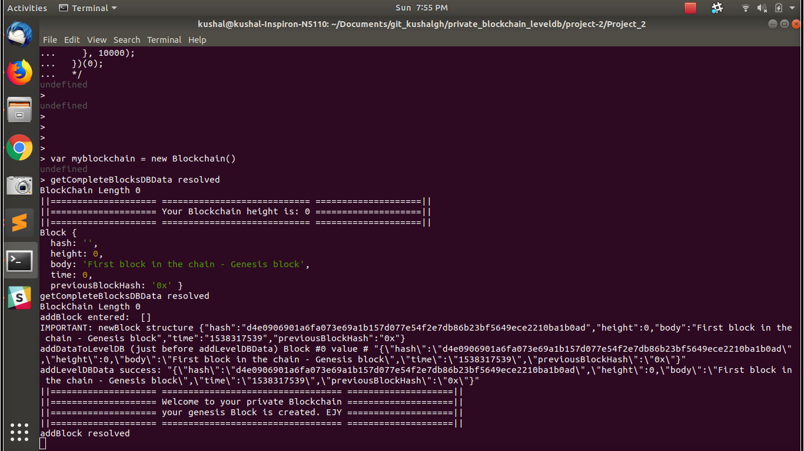


5: Generate 10 blocks using a for loop
```
for (var i = 0; i <= 10; i++) {
  blockchain.addBlock(new Block("test data "+i));
}
```

Note: For testing, I have added 4 Blocks. 
```
blockchain.addBlock(new Block("First Custom Block"));
```

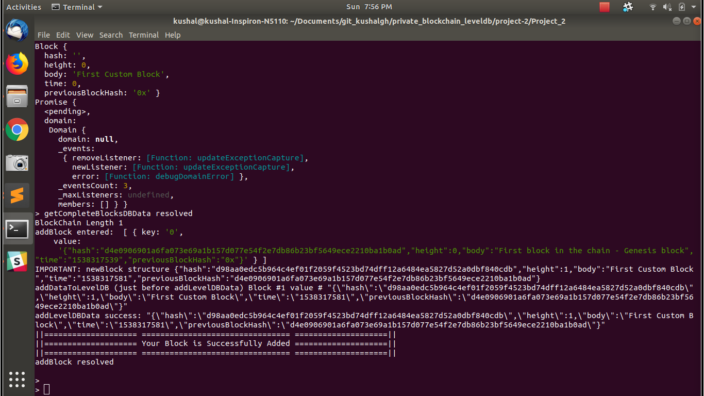


6: Check the Block height
```
blockchain.getBlockHeight();
```

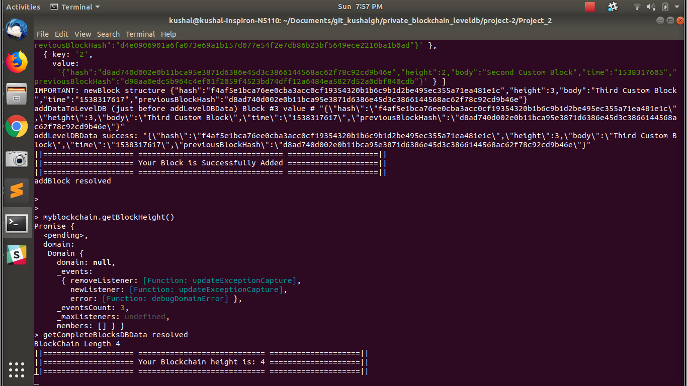


7: Get Details of particular Block
```
blockchain.getBlock("2")
```

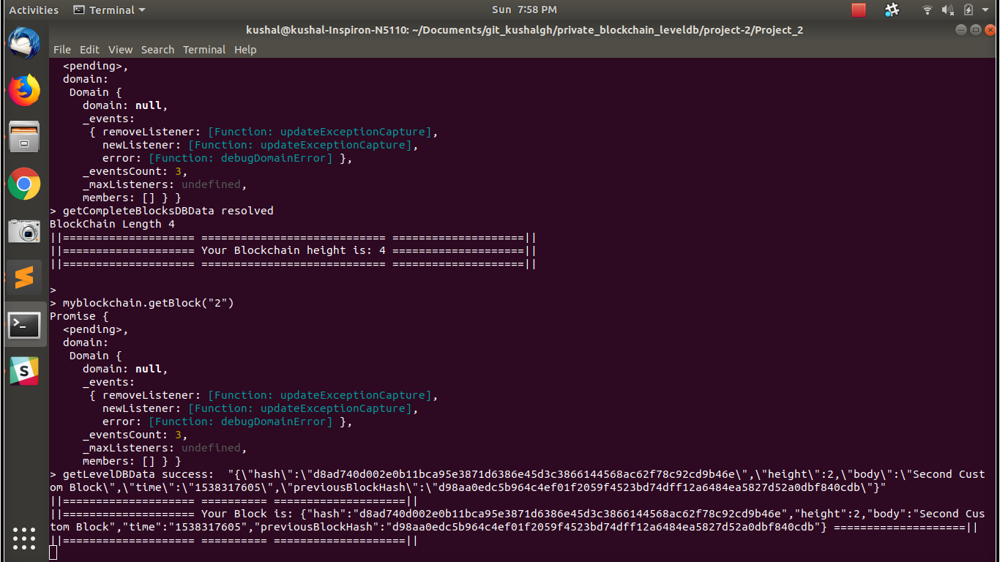


8: Validate Block
```
blockchain.validateBlock("2")
```

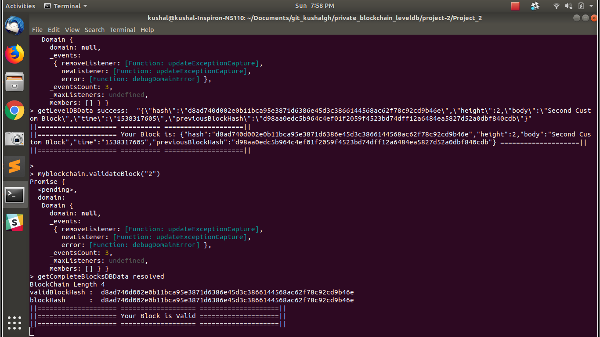


9: Validate BlockConnection
```
blockchain.validateBlockConnection("2")
```

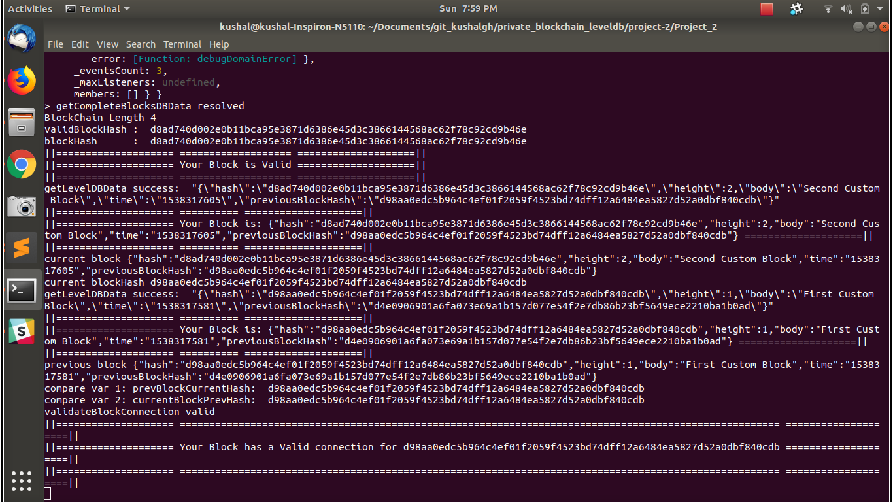


10: Validate Blockchain
```
blockchain.validateChain();
```

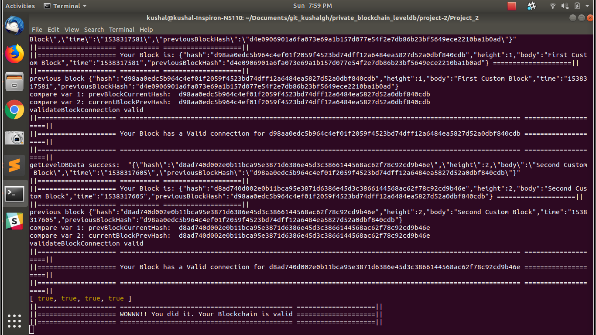


11: Print BlockChain
```
blockchain.printBlockChain();
```

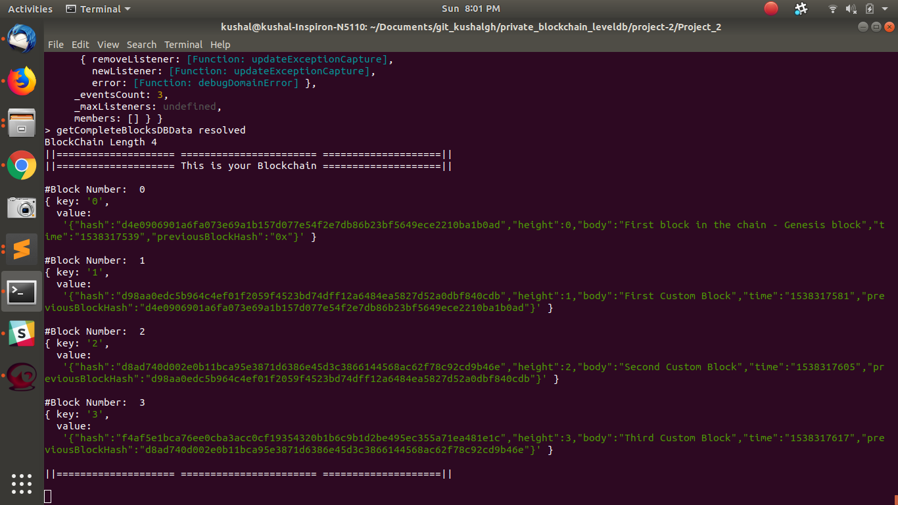


12: Induce errors by changing block data [This is created intentionaly to check this scenario ]
```
addLevelDBData("2", new Block("It's an Induced Error"));
```

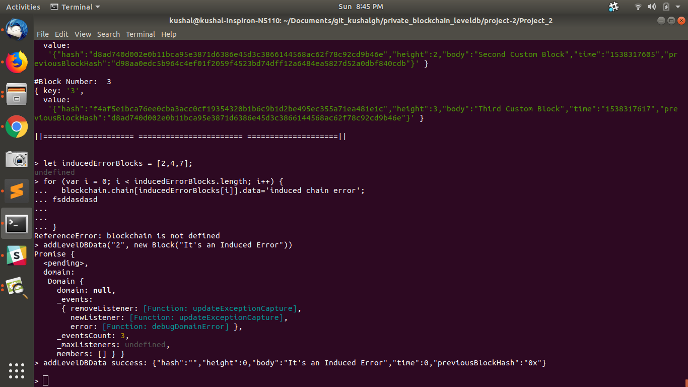
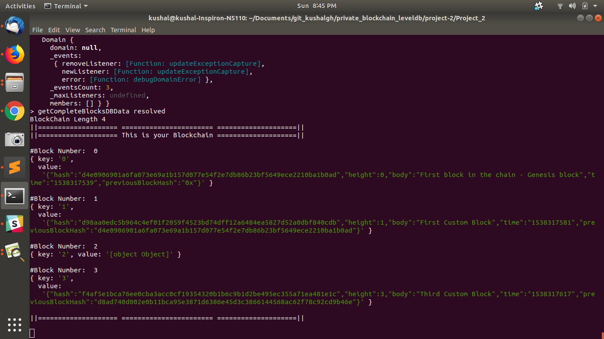

8: Validate blockchain. The chain should now fail .
```
blockchain.validateChain();
```

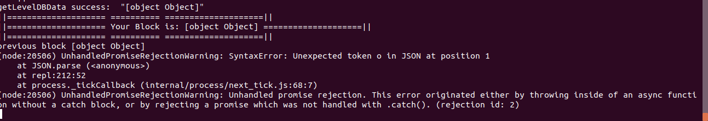


# HAPPY CODING!!
